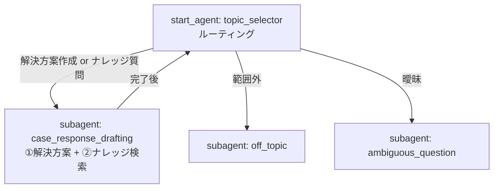

# Agent Spec: Service Assist Agent（サービス担当Agent）

> スコープ: HTML仕様 **① Agent Assist（回答生成）** と **② 応対中のナレッジ横断検索** を、**同一エージェント・同一サブエージェント**に統合実装。
> ② の RAG 検索は **Agentforce Data Library（Data Cloud）** で実現。

## Purpose & Scope
サービス拠点担当者向けの社内アシスタント。1つのエージェント `Service_Assist_Agent` が次の2つを担う:
- **① 解決方案の作成・保存**: Case の情報を参照して解決方案（AI Resolution Plan）を生成し、Case のカスタム項目 `AI_Resolution_Plan__c` に書き込む（顧客への送信はしない。担当者が確認・修正）。
- **② ナレッジ横断検索（RAG）**: 担当者の質問に対し、Salesforce Knowledge をソースにした Agentforce Data Library で意味検索（RAG）し、引用付きで回答する。

## Behavioral Intent（要件・制約）
- **①**: 担当者がCaseのIDを添えて解決方案作成を依頼 → Case詳細を取得 → 取得内容のみを根拠に解決方案を生成 → `AI_Resolution_Plan__c` に保存 → 「保存しました」と伝え確認・修正を促す（同じ生成を繰り返さない）。送信機能は持たない。
- **②**: 担当者がナレッジ質問（手順・トラブルシューティング・製品情報等）をした場合 → Data Library を RAG 検索 → `knowledgeSummary` を根拠に回答し `citationSources`（参照記事）を明示。検索結果に無い内容は創作しない。
- 社内従業員が使う → **Employee Agent**（ログインユーザー権限・共有ルール準拠）。

## Configuration
- **Agent type**: `AgentforceEmployeeAgent`
- **Developer name**: `Service_Assist_Agent`
- **Label**: サービス担当Agent
- **Default agent user**: N/A（Employee Agent。ログインユーザーとして実行）
- **Permissions verified**: 実行担当者に Case の参照権限、`AI_Resolution_Plan__c` の編集権限（FLS。権限セット `Service_Assist_Agent_Access` で付与）、および Data Cloud/Data Library へのアクセスが必要。

## Data Cloud / Data Library（② RAG基盤）
- **Data Cloud**: nidecPoc org で有効化済み（プロビジョニング完了）。※ フルライセンス表記が無くても、有効化さえ済めば Agentforce Data Library は利用可能。
- **Agentforce Data Library**: `Service Knowledge Library`（API参照名 `Service_Knowledge_Library`）
  - データ型: **ナレッジ**（Salesforce Knowledge をソース）
  - 識別項目: Title, Summary / 内容項目: Summary
  - 状況: 準備完了（インデックス済み）
- **紐付け**: Agentforce Builder の[データライブラリ]タブで、このライブラリをエージェントに割り当て → `AnswerQuestionsWithKnowledge`（ナレッジを使用して質問に回答）アクションがこのライブラリでグラウンディング。内部的に `ragFeatureConfigId`（`AiRagFeaturePromptContent_<UUID>`）がバインドされる。

## Subagent Map

- **topic_selector**（start_agent, ルーター/ハブ）: ユーザー発話を振り分ける。解決方案作成もナレッジ質問も `case_response_drafting` へ。
- **case_response_drafting**（domain, 統合）: ①②の全アクションを保持する単一サブエージェント。
- **off_topic** / **ambiguous_question**（guardrail）: 標準ガードレール。

## Actions & Backing Logic（case_response_drafting に統合）
| Action | 種別 | Target / source | Inputs | Outputs | 用途 |
|--------|------|-----------------|--------|---------|------|
| get_case_details | 標準アクション Get Record Details | `standardInvocableAction://getDataForGrounding` / source `EmployeeCopilot__GetRecordDetails` | recordId (object, `lightning__recordIdType`) | snapshot | ① Case取得 |
| update_case | カスタム invocable Apex | `apex://SaveCaseResolutionPlan` | recordId (string), resolutionPlan (string) | isSuccess, message | ① 保存（AI_Resolution_Plan__c 書込み） |
| answer_with_knowledge | 標準アクション Answer Questions with Knowledge | `standardInvocableAction://streamKnowledgeSearch` / source `EmployeeCopilot__AnswerQuestionsWithKnowledge` | query (string) | knowledgeSummary, citationSources | ② RAG検索 |

### 補足
- **保存は Apex（`SaveCaseResolutionPlan`）を採用**。標準 Update Record を使わない理由は「[保存に標準 Update Record を使わない理由](#保存に標準-update-record-を使わない理由)」を参照。
- **② は Data Library 紐付けが前提**。ライブラリ未紐付けだと「ナレッジベースの検索が利用できません」となる。
- 標準アクションの `target` は `invocationTarget`、`source` は `EmployeeCopilot__*` の参照名。Get Record Details の `recordId` は `object` + `complex_data_type_name: "lightning__recordIdType"`。

## 保存に標準 Update Record を使わない理由

① の解決方案の保存（Case の `AI_Resolution_Plan__c` へ LLM 生成の長文を書き込む）には、標準アクション **Update Record**（`EmployeeCopilot__UpdateRecordFields` / invocationTarget `einsteinCopilotUpdateRecord`）ではなく **カスタム invocable Apex** を採用した。理由は以下の通り。

### 1. Update Record は単独では動かず、前段に Extract アクションが必須
Update Record の入力は `recordDetailInput`（型 `lightning__recordInfoType`）1つだけで、org から取得した実スキーマの説明文には次のように明記されている（`genAiPlannerBundles/.../UpdateRecordFields_*/input/schema.json` より原文引用）:

> "更新されるレコードの項目とその値。この入力は、**ExtractFieldsAndValuesFromUserInput アクションの出力と完全に同じ**です。"
>
> "Field-value pairs for the record to be updated. **The value of this input parameter must be the exact output of ExtractFieldsAndValuesFromUserInput recordDetails, don't ever change the recordDetails output**"

つまり Update Record は、**先に `ExtractFieldsAndValuesFromUserInput`（項目と値をユーザー入力から抽出する別の標準アクション）を実行し、その出力（`recordDetails`）をそのまま渡す**2段構成が前提。単体で「この項目にこの値を書く」とは指定できない。

- 公式リファレンス: [Agentforce Platform | Update Record](https://help.salesforce.com/s/articleView?language=en_US&id=ai.copilot_actions_ref_update_record.htm&type=5)
- 公式リファレンス: [Agentforce Platform | Extract Fields and Values from User Input](https://help.salesforce.com/s/articleView?id=ai.copilot_actions_ref_extract_fields_values.htm&language=en_US&type=5)
- 標準アクション一覧: [Standard Agent Action Reference](https://help.salesforce.com/s/articleView?language=en_US&id=sf.copilot_actions_ref.htm&type=5)

### 2. 「ユーザー入力からの項目抽出」であり「LLM生成長文の指定項目への書込み」ではない
`ExtractFieldsAndValuesFromUserInput` は、その名の通り**ユーザーの発話**から更新対象の項目名と値を抽出する対話的更新の仕組み。①は「担当者との対話で項目を編集する」のではなく「**LLM が生成した解決方案の長文を、固定の `AI_Resolution_Plan__c` に確実に書き込む**」用途であり、抽出ベースの仕組みとは目的が合わない。`recordDetailInput` は複合型（`lightning__recordInfoType`）で、Agent Script から生成長文を手動バインドすることも困難。

### 3. 参照実装（agentDst 経費申請確認Agent）も Case 更新は Update Record を使っていない
標準実装のリファレンスである agentDst の **経費申請確認Agent（`ExpenseRequestValidationAgent`）** を retrieve して調査した結果:
- Case への AI 確認結果の書込みには、**カスタム autolaunched Flow `Expense_Case_Update`**（`invocationTargetType: flow`、入力 `caseNumber` + `aiCheckResult`）を使用。
- `UpdateRecordFields`（標準）は bundle 上に定義こそあるが、前提の `ExtractFieldsAndValuesFromUserInput` は**どのサブエージェントにも追加されておらず、実運用されていない**（grep で説明文の言及のみ）。

→ つまり、「特定 Case の項目に AI 結果を書き込む」処理は、**Salesforce 公式のリファレンス Agent でも標準 Update Record ではなくカスタム実装（Flow）で行っている**。本実装の Apex 採用はこれと同じ設計判断。

### 4. 実地検証でも標準単独保存はエラー・非機能
`.agent` に標準 Update Record を手書きで結線した構成では、`sf agent publish` が「Internal Error」で失敗。Builder UI で Update Record + Extract を追加する検証も、Extract 追加時に UI がハングして完遂できなかった。一方、Apex 版（`SaveCaseResolutionPlan`）は preview で `AI_Resolution_Plan__c` へ約1000字の書込みを実データで動作実証済み。

### 結論
- **取得（Get Record Details）・ナレッジ検索（Answer Questions with Knowledge）は標準アクションで実装**（動作実証済み）。
- **保存はカスタム Apex** が、確実性・目的適合・参照実装との整合の全観点で最適。標準 Update Record は Extract 依存・対話抽出前提・参照Agent非採用のため不採用。

## ヒットしたスキル（開発に使用/関連）
本エージェントの設計・実装・検証に用いた、または関連する `.claude/skills/` 配下のスキル。

| スキル | 役割 | 本作業での使用 |
|--------|------|----------------|
| **developing-agentforce** | Agent Script（.agent）作成・標準アクション/retriever結線・Employee Agent構成・preview/publish/activate | **主**。中核として全工程で使用 |
| **testing-agentforce** | AiEvaluationDefinition による自動テスト | 副（今回はpreviewで検証、テストスペックは未作成） |
| **using-sf-cli** | `sf agent` 系コマンドのクイックリファレンス | CLI補助 |
| **deploying-metadata** | メタデータ deploy / scratch org / CI/CD | Apexクラス・項目・権限セットのデプロイ |
| **retrieving-datacloud** | Data Cloud の retriever / vector search | ②の Data Library（RAG）基盤の裏側 |
| **preparing-datacloud** | data stream / DLO / ingestion | ② の Data Library へのナレッジ取り込み基盤 |
| **fetching-salesforce-docs** | 公式ドキュメント取得 | 標準アクション名・Update Record仕様・Data Library手順の確認 |

- **非ヒット**: developing-agentforce-mcp-actions（MCP不使用）, generating-apex（Apexは単純な保存クラスのため専用スキル不使用でも可）
- 補足: 実際の Data Library 作成・エージェント紐付けは **Agentforce Builder（Setup UI）** で実施（CLI に `sf agent adl` 系コマンドが無いため）。developing-agentforce スキルはこの UI 手順を直接はカバーしないため、本仕様書の「実装の要点」に手順を記録している。

## Variables
| 変数 | 型 | 初期値 | 用途 |
|------|----|-------|------|
| plan_saved | mutable boolean | False | 解決方案を保存済みか（ループ防止ゲート） |
| knowledge_summary | mutable string | "" | 直近のナレッジ検索要約のキャッシュ |

## Gating Logic
- 保存後は post-action instructions で再生成を抑止し、`plan_saved` を True に。
- ①②の分岐は router の説明文と case_response_drafting の instructions（A: 解決方案 / B: ナレッジ検索）で誘導。No hard gating（LLMが要求に応じて適切なアクションを選択）。

## 検証状況（preview 実証済み）
- **① 取得・生成・保存**: 標準 Get Record Details で Case取得 → 解決方案生成 → Apex保存。DB確認で `AI_Resolution_Plan__c` へ約1000字書込みを実証。
- **② RAG検索**: 「発電機のメンテナンス頻度は？」に対し、Data Library 経由で Knowledge記事「Generator Maintenance Guidelines」を検索し、250h/500h ごとの整備内容を **引用[1]付き**で回答することを会話プレビューで実証。

## 実装の要点（再現手順）
1. nidecPoc で Data Cloud を有効化（Setup > Data Cloud 設定ホーム > 使用を開始）。
2. Agentforce Data Library `Service_Knowledge_Library` を作成（データ型=ナレッジ、Knowledge記事をソース）。
3. `.agent` に3アクションを記述（get_case_details=標準 / update_case=Apex / answer_with_knowledge=標準）。標準アクションは `target`+`source`、recordId は object型で指定。
4. Agentforce Builder の[データライブラリ]タブでライブラリをエージェントに紐付け。
5. 有効化 → 会話プレビューで①②を検証。

## 関連メタデータ
- AiAuthoringBundle: `Service_Assist_Agent`
- Apex: `SaveCaseResolutionPlan`（保存）, `GetCaseDetailsForAgent`（旧・Apex版取得。標準Get Record Details採用により未使用）
- Custom Field: `Case.AI_Resolution_Plan__c`（Long Text Area）
- Permission Set: `Service_Assist_Agent_Access`（FLS + Apexアクセス + agentAccesses）
- Data Library: `Service_Knowledge_Library`（Knowledge記事4件をインデックス）
